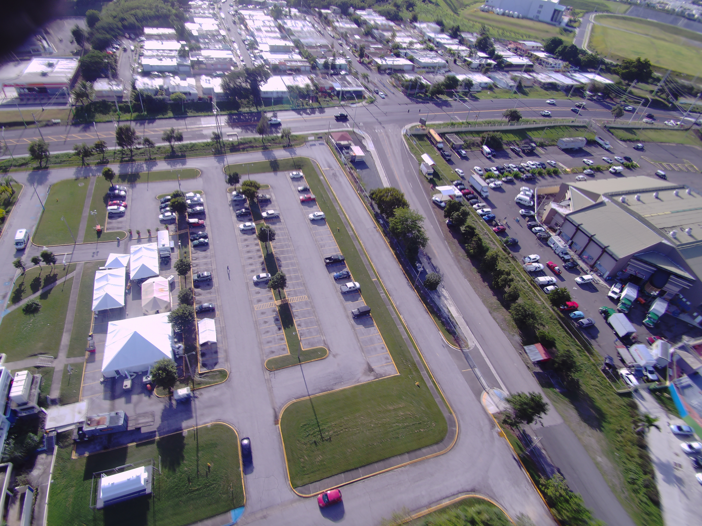

# Team 2: Rapid Image Acquisition for Disaster Analysis - RIADA

| Michael Blow | Jacob Ellena | Miguel Martin Menez |
|:------------:|:------------:|:-------------------:|
|[LinkedIn](https://www.linkedin.com/in/michaeljblow/)|[LinkedIn](https://www.linkedin.com/in/jellena/)|[LinkedIn](https://www.linkedin.com/in/miguelmenez/)|

## Prompt: Finding Tents and Other Emergency Housing Through Exploitation of Satellite Imagery (changed by client, see below)
## Client: New Light Technologies

## Problem Statement and Data Science Question

In the aftermath of natural disasters, displaced persons can be forced from their homes into makeshift shelters / tents. It is in the interests of FEMA and other disaster response agencies to locate these tents quickly, so that the displaced populations can be contacted, provided for, and possibly brought to organized camps.

Our problem statement is:

**In the aftermath of natural disasters, how can we identify key areas of need? Can aerial imagery be used to identify informal shelters?**

It is important to note that based on the client’s needs, the scope of this project was changed. After asking the client some questions for clarification (through DSI Instructor Matt Brems), the client asked us to focus on Civil Air Patrol (CAP) imagery instead of satellite imagery, as CAP imagery is more readily available post-disaster. After discussing the change in scope with Matt Brems, it was identified that the Minimum Viable Product (MVP) would be a collection tool that could be run from the client's computer, access the CAP pictures, and download them locally. This proved to be a realistic MVP because unlike satellite imagery, CAP imagery is non-standard, with images taken from different cameras, altitudes, and angles, presenting a large pre-processing challenge for neural network modeling.

The team was able to achieve the MVP, and attempted to learn and run a convolutional neural network. Given more time and resources, the team would want to answer the question:

**Can a Convolutional Neural Network be built that takes non-standard images from the CAP and classifies them based on the presence of tents?**

## Table of Contents

- firefox_gecko_driver - Required for Selenium library used in RIADA
- images - Images used in the readmes
- riada-cap-file-collecting - The Riada tool, split into the jupyter notebooks and python scripts of each collector, as well as a [technical README](riada-cap-file-collecting/README.md) file.
- [ExecSum_Riada](ExecSum_Riada) - Executive summary of the tool
- [geckodriver.log](geckodriver.log) - Produced by the gecko tool used by Selenium library
- [new_light_project_presentation.pptx](ew_light_project_presentation.pptx) - Project presentation
- [README.md](readme.md) - This README file

For the purposes of examining our product, please open the riada-cap-file-collecting folder, and examine its jupyter notebooks alongside its technical README.

## The Data

Collecting data from the CAP site proved to be a challenge. While the backend looks like a simple html site, javascript is used to dynamically generate page info. The group had to learn and use Selenium webdriver to navigate to the necessary pages to download images with request library though this site:

http://fema-cap-imagery.s3-website-us-east-1.amazonaws.com/Images/

Three different collection scripts were written each to accommodate the needs of relief agencies:

File Size Estimator
Outputs:
Total number of flights
Total number of images
Estimated file size of all images

Event Image Collector
Outputs:
Event number directory to user’s Desktop
Directory of each flight number
Image from each flight in requisite directory
Log of images

Flight Image Collector
Outputs:
Directory with both Event number and Flight number
Images from flight
Log of images

For more technical information about the collectors, please see the [README](riada-cap-file-collecting/README.md) in the Riada folder.

The group tested the RIADA tool using CAP imagery from the January 2020 earthquakes in Puerto Rico, under event number 616567. A total of 17,947 images were downloaded (85gb worth of data). The summary log for this collection showed only 3 failed downloads.

The group then prepared the data for a supervised model, identifying more than 400 images without a tent, and 200 with a tent.

Example of an image with tents:

## Software Requirements

RIADA runs on MacOS, and requires the following:

Programs:
- [Mozilla Firefox](https://www.mozilla.org/en-US/firefox/new/)
- [Mozilla Geckodriver](https://github.com/mozilla/geckodriver)

Python Libraries:
- [pandas](https://pandas.pydata.org/)
- [selenium](https://pypi.org/project/selenium/)
- [requests](https://requests.readthedocs.io/en/master/)
- [os](https://docs.python.org/3/library/os.html)
- [time](https://docs.python.org/3/library/time.html)
- [pathlib](https://docs.python.org/3/library/pathlib.html)

During the development of the tool, the team recognized that that the tool could be used in the field where a fast internet connection is not available, so the tool was further adjusted to accept variable wait times between downloads.

## Future Developments

Given more time and resources, the team recommends the following:

Adapt RIADA for Windows OS
Develop a convolutional neural network model that identifies which images have tents, and which do not (which includes pre-processing the images)
Create a Graphical User Interface (GUI) for RIADA
Add start/stop functionality into RIADA
