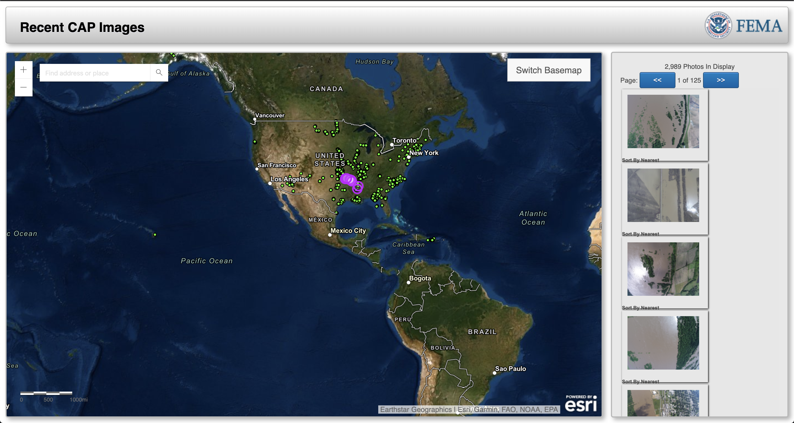

# Image Scraping for Civil Air Patrol Data

Civil Air Patrol data for emergency situations is provided in two formats.

#### [Geoplatform.gov Disasters Imagery Viewer](https://disasters.geoplatform.gov/imagerybrowser/?webmap=2c7dabb4a0594861a8bac3944b931d2d)

Map based GUI to view CAP imagery. Useful to identify specific location but cumbersome to gather multiple images.

#### [FEMA CAP Image Repository](http://fema-cap-imagery.s3-website-us-east-1.amazonaws.com/Images/)

Main repository for image storage. Tools such as the geoplatform viewer are built from the data stored here. Difficult to find specific images but formatted for larger data acquisitions.

Site is built with javascript so Selenium was used in tandem with requests library

### Requirements

The following libraries are needed for the scraping tools to function:
- [pandas](https://pandas.pydata.org/)
- [selenium](https://pypi.org/project/selenium/)
- [requests](https://requests.readthedocs.io/en/master/)
- [os](https://docs.python.org/3/library/os.html)
- [time](https://docs.python.org/3/library/time.html)
- [pathlib](https://docs.python.org/3/library/pathlib.html)

### Tools

#### Image Count and Size Finder
This python script will accept an input from the user of one event number. It will then proceed to find:
 -  Total Number of flights in the event
 -  Total number of images
 -  Size of the largest image
 -  Total file Size

This information is intended to allow for the end user to get an idea of how large the data in an event may be. To ensure they have enough storage and time to download all information.

*Notes*

The file size data is under the assumption that all files are MB in size. Some may be kb which may over estimate the total if they are present in the data set.

#### Complete Event Image Scraper

This script will take an event number from user and scrape ever image in the even to the users desktop. Images are broken down by flight directory with the flight number appended to the file name.

A log is generated to show potential errors that may occur.

#### Flight Event Image Scraper

This script will take an event and flight number and download all images in that directory. Useful if flights have been added after a Complete Event Scrape.

---
---
### Future Development
##### All
- Develop Windows compatible versions
- Implement basic graphical interface
- Allow user to chose download path
- Merge all scrapers into one master applet

##### Image Count and Size Finder
- Update size estimate to account for varying file sizes

##### Complete Event Image Scraper
- Start/Stop Downloading
  - Allow users to be able to start a download then stop and restart at a later date  
- Better handling of bad HTML status codes
  - Allow scripts to handle a variety of errors codes to retry downloads
- Ability to scrape multiple image file types

##### Flight Event Image Scraper
- Start/Stop Downloading
  - Allow users to be able to start a download then stop and restart at a later date
- Better handling of bad HTML status codes
  - Allow scripts to handle a variety of errors codes to retry downloads
- Ability to scrape multiple image file types
